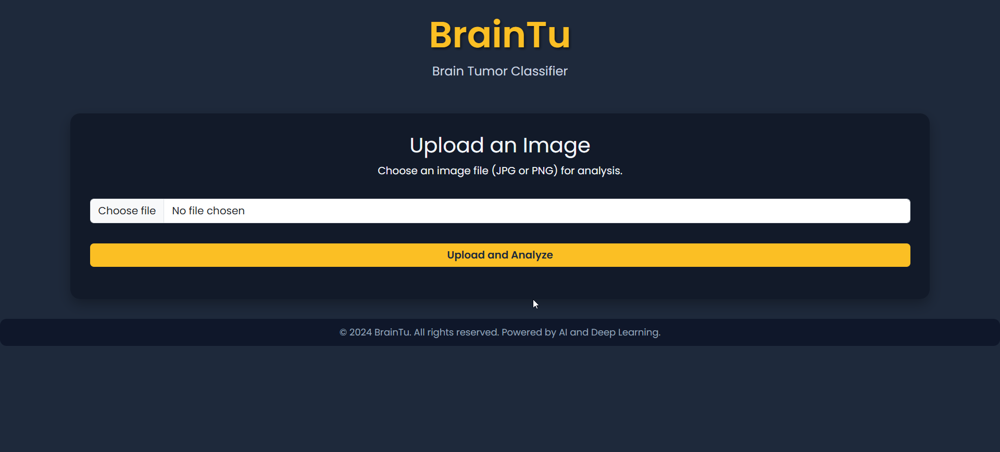
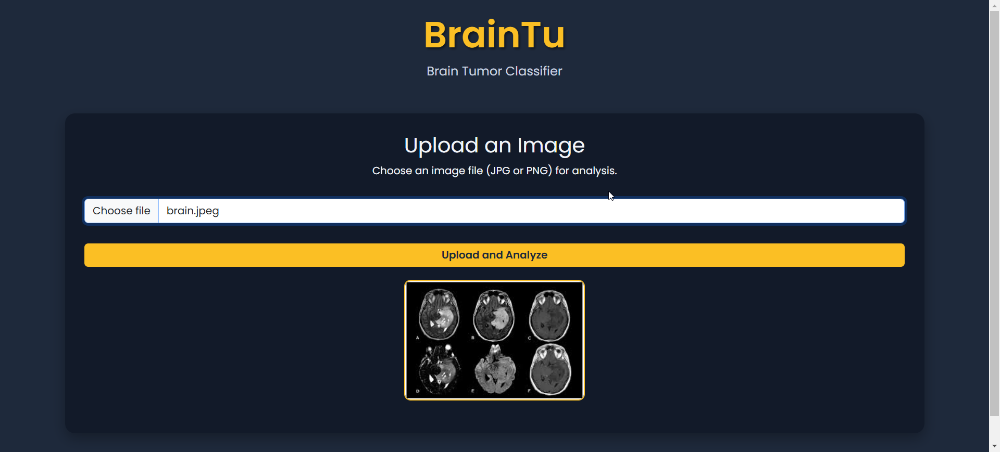
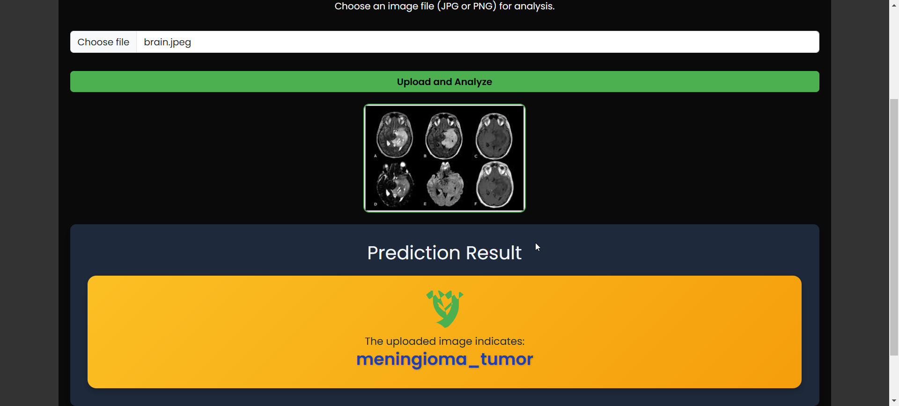

# BrainTu: Brain Tumor Classifier

BrainTu is a deep learning-powered web application designed to classify brain tumors based on medical images. It provides an intuitive interface where users can upload images, and the model predicts the type of tumor in real-time. This project leverages Convolutional Neural Networks (CNNs) to deliver accurate and efficient predictions.

---

## **Features**
- Predicts brain tumor types:
  - **Glioma Tumor**
  - **Meningioma Tumor**
  - **No Tumor**
  - **Pituitary Tumor**
- Web-based interface using **Flask** for backend and HTML/CSS/Bootstrap for frontend.
- Image upload and preview functionality.
- Responsive and user-friendly UI with real-time results display.
- Error handling for invalid or corrupted image uploads.

---

## **Technologies Used**

### **Backend:**
- Python
- Flask
- TensorFlow/Keras

### **Frontend:**
- HTML, CSS, JavaScript
- Bootstrap

### **Model:**
- Convolutional Neural Network (CNN)
- Pre-trained model (`BrainTu.h5`)

---

## **Project Structure**
```
BrainTu/
|-- app.py                     # Flask app for serving the application
|-- BrainTu.h5                 # Pre-trained CNN model
|-- Templates/
|   |-- index.html             # Frontend HTML file
|-- README.md                  # Project documentation (this file)
```

---

## **Setup and Installation**

### **Requirements:**
- Python 3.8 or higher
- Required Python libraries (specified in `requirements.txt`):
  ```
  Flask==2.2.2
  TensorFlow==2.11.0
  Pillow==9.3.0
  numpy==1.23.5
  ```

### **Steps to Run the Project:**
1. Clone the repository:
   ```bash
   git clone https://github.com/Ashwanikrs/BrainTm.git
   cd BrainTm
   ```
2. Install the required packages:
   ```bash
   pip install -r requirements.txt
   ```
3. Add the pre-trained model (`BrainTu.h5`) to the root directory.
4. Run the Flask app:
   ```bash
   python app.py
   ```
5. Open your web browser and navigate to:
   ```
   http://127.0.0.1:10000/
   ```

---

## **Usage**
1. Upload an image (JPG or PNG) of a brain scan.
2. Click the **"Upload and Analyze"** button.
3. View the predicted tumor type on the result card.

---

## **Screenshots**
### **Homepage:**




### **Prediction Result:**



---


## **License**
This project is licensed under the MIT License. See the [LICENSE](LICENSE) file for details.

---


